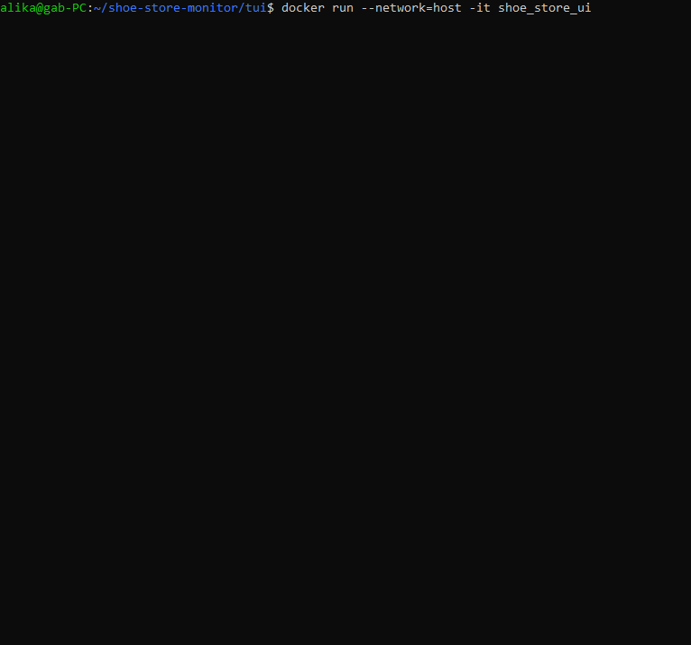

# Shoe store application

This toy application monitors shoe sales and suggests selling strategies in real-time by processing incoming sales data via WebSocket.



This is my take on the shoe store problem: https://github.com/mathieugagne/shoe-store.

This project is my first experience with Ruby and Rails. I focused on building a couple of small but complete features with tests and validation, in order to cover foundations on top of which more features can be built. This way I got to discover various facets of working with Rails💎

The UI is made with the [Bubble Tea](https://github.com/charmbracelet/bubbletea) framework, for no reason other than I had an itch to try it ✨

## API documentation
The OpenAPI documentation can be found in the [public](public/apidoc.yml) folder

## Features

### Shoe popularity report
We report % of sales for each shoe model.

I assume that each event coming from the provided program represents 1 sale, and also assume that 1 sale means 1 pair of shoes sold. Based on that I can report sales per model / total sales.

The original program from the challenge creates sales of each model with equal probability, I modified it to create more variation in sale numbers.

### Shoe store suggestions

Based on the number of sales per model, we suggest discounting unpopular items, and re-stocking on popular ones.

# Running in docker
Dockerfiles and a docker-compose are provided for convenience.

## Pre-requisites
- Docker
- Docker-compose

## Run the shoe store API and the shoe events app

```
docker-compose build
docker-compose up -d
```

## Run the UI
Since it's a terminal UI, it doesn't display well in docker-compose, but it runs nicely with just docker:
```
docker build -t shoe_store_ui tui
docker run --network=host -it shoe_store_ui
```

You should see the UI (make sure your terminal window is big enough).
You should also be able to poke the API endpoints:
```
curl --location 'http://localhost:3000/popularity'
curl --location 'http://localhost:3000/suggestions'
```

# Running on host

## Pre-requisites
- Ruby 3.3.3
- Go 1.22 or Linux

## Run the shoe events app
A modified version of the app provided with the challenge is in the shoe_store_challenge_input folder. Run it with:
```
cd shoe_store_challenge_input
bin/websocketd --port=8080 ruby inventory.rb
```

## Run the shoe store API
In another terminal, run:
```
bundle install
rails db:setup
rails test # if you want to run tests
rails s
```

You should be able to poke the API endpoints:
```
curl --location 'http://localhost:3000/popularity'
curl --location 'http://localhost:3000/suggestions'
```

## Run the UI

If you don't have Go installed, but you're on Linux, you can use the Docker steps above (on other systems the network=host flag isn't supported and requests won't go through.)
If you have Go, you can:
```
cd tui
go run .
```
You should see the UI (make sure your terminal window is big enough).

## Implementation notes
- While discovering Ruby and Rails, I had more questions than time to pursue each one fully. I left notes and todos for unfinished items.
- The Rails project is used as an API, serving JSON data to the terminal UI. However, since I started the project by following a basic Rails tutorial, it is configured as a web app and includes a minimal HTML page. If I were to do it again, I'd configure the Rails app as an API app.
- Testing approach:
    - Integration tests cover as much of the logic as I could: processing new sales events, calculations business logic, model validation. Would have wanted to also cover the websocket client, but couldn't get it to work quickly.
    - Unit tests cover main business logic to make extra sure it is right.
